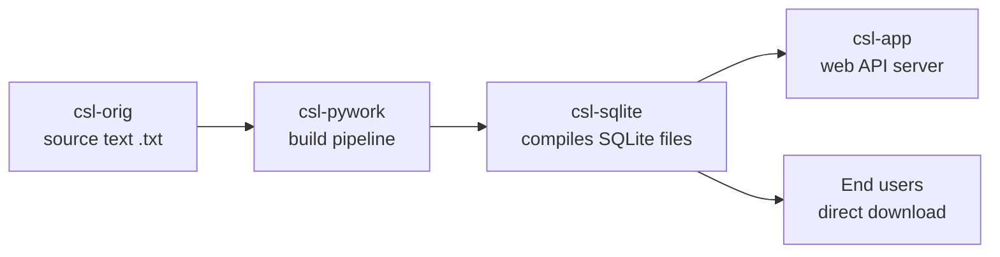

# Architecture — csl-sqlite

## System diagram

## Role in the CDSL pipeline

csl-sqlite receives per-dictionary data that has been processed through csl-pywork
and packages it as SQLite databases — one file per dictionary — for distribution
via GitHub Releases and consumption by csl-app and researchers.

This repository contains **no scripts**; it is a pure distribution channel. The
generation pipeline that produces the SQLite files lives in `csl-pywork`.

## Key files

| Path | Purpose |
|---|---|
| `README.md` | User-facing overview and download instructions |
| `CLAUDE.md` | Guidance for Claude Code when working in this repo |
| `LICENSE` | MIT licence |

The SQLite files themselves are stored as **GitHub Releases assets**, not committed to
the repository tree.

## SQLite schema

Each dictionary produces a `<short>.sqlite` file with two primary tables:

| Table | Contents |
|---|---|
| `dict` | One row per dictionary entry, keyed by headword (`key`) |
| `flatdict` | Flattened full-text index for search |

## Data flow

1. Dictionary source text in `csl-orig` is corrected or updated.
2. `csl-pywork` runs the build pipeline and produces per-dict intermediate files.
3. The pipeline generates `<short>.sqlite` files from the intermediates.
4. Compiled SQLite files are uploaded as assets of a new GitHub Release in this repo.
5. `csl-app` downloads the releases and serves dictionary data via its web API.
6. Researchers and downstream tools download SQLite files directly from the Releases page.

## Key design decisions

| Decision | Rationale |
|---|---|
| SQLite format | Portable, embeddable, no server required |
| One file per dictionary | Independent updates; smaller downloads; simpler dependency tracking |
| Distribution via GitHub Releases | No git-lfs costs; versioned; direct download URLs |
| No scripts in this repo | Separation of concerns — build logic lives in csl-pywork |

## Scaling and limits

- The repository tree itself stays small (no binary data committed); only Releases grow.
- `git pull` on this repo is explicitly discouraged — it would download all Release assets unnecessarily.
- [to be verified by reviewer: approximate total size of all SQLite files per release]

## External dependencies and versions

| Dependency | Version | Why pinned |
|---|---|---|
| GitHub Releases storage | n/a | Platform dependency; no version to pin |
| SQLite file format | ≥ 3.x | Produced by csl-pywork; any modern SQLite reader compatible |
