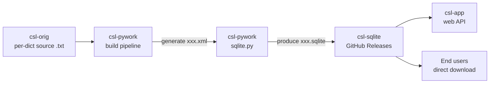

# Architecture — csl-sqlite

## System diagram



## Role in the CDSL pipeline

csl-sqlite is the **distribution channel** for CDSL dictionary data. It contains no
build scripts of its own — every SQLite file is produced upstream by
[csl-pywork](https://github.com/sanskrit-lexicon/csl-pywork) (specifically the
template at `v02/makotemplates/pywork/sqlite/sqlite.py`) and uploaded here as a
GitHub Release asset.

The repository tree itself is intentionally small (a handful of docs). Each release
adds ~250 MB of zipped SQLite files as release assets — these are **not** stored in
git history, which is why `git pull` on this repo is discouraged.

## What's in a release

Latest release ([2026-05-17-07-42-11](https://github.com/sanskrit-lexicon/csl-sqlite/releases/latest))
publishes ~50 zip assets in three categories:

### Per-dictionary SQLite files (`<short>.zip`)

42 main dictionaries. Each `<short>.zip` contains `<short>.sqlite`. Sizes range from
~50 KB (`acsj`) to ~27 MB (`mw`).

Coverage: `abch, acc, acph, acsj, ae, ap, ap90, armh, ben, bhs, bop, bor, bur, cae,
ccs, fri, gra, gst, ieg, inm, krm, lan, lrv, mci, md, mw, mw72, mwe, pe, pgn, pui,
pw, pwg, pwkvn, sch, shs, skd, snp, stc, vcp, vei, wil, yat`.

### Literary-source link files (`<short>_lslinks.sqlite.zip`)

Per-dictionary cross-reference databases linking entries to literary source citations
(`<ls>` tags). Available for `ap`, `gra`, `mw`, `pw`, `pwg`, `sch` so far.

### Auxiliary global databases

| File | Purpose |
|---|---|
| `hwnorm1c.sqlite.zip` | Normalized headword table across all dicts (~10.6 MB) |
| `keydoc_glob1.sqlite.zip` | Global key-doc index (~9.8 MB) |

## SQLite schema (per-dict files)

Generated by [`v02/makotemplates/pywork/sqlite/sqlite.py`](https://github.com/sanskrit-lexicon/csl-pywork/blob/master/v02/makotemplates/pywork/sqlite/sqlite.py)
in csl-pywork. Each file contains a **single table named after the dictionary's
short name**:

```sql
CREATE TABLE <short> (
  key  VARCHAR(100) NOT NULL,
  lnum DECIMAL(10,2) UNIQUE,   -- non-UNIQUE for abch, acph, acsj
  data TEXT NOT NULL
);
CREATE INDEX datum ON <short>(key);
```

| Column | Meaning |
|---|---|
| `key` | Headword in SLP1 (matches `<key1>` in the embedded XML) |
| `lnum` | Entry number (decimal sub-entries like `116525.7` denote homophone variants); unique except in `abch`, `acph`, `acsj` |
| `data` | XML-wrapped entry body: `<H1><h><key1>…</key1><key2>…</key2></h><body>…</body></H1>` |

The `data` column stores a self-contained XML fragment per entry — the same structure
that downstream consumers like csl-app parse for HTML rendering.

## SQLite schema (lslinks / auxiliary files)

`<short>_lslinks.sqlite` files contain one table with columns `key` and `data`
(no `lnum`). The auxiliary `keydoc_glob1.sqlite` follows the same shape.

## Data flow

1. Source text in `csl-orig/v02/<short>/<short>.txt` is corrected.
2. csl-pywork's per-dict pywork tree generates `<short>.xml` (canonical XML form).
3. `sqlite.py` reads the XML and INSERTs one row per `<H1>` entry into the
   `<short>` table, with `key` from the `<key1>` element.
4. The build packages the resulting `<short>.sqlite` into `<short>.zip`.
5. A new GitHub Release is created in csl-sqlite with all per-dict zips as assets.
6. csl-app and other downstream consumers download the assets they need.

## Key design decisions

| Decision | Rationale |
|---|---|
| SQLite single-table per dict | Each dict is self-contained; no schema drift between dicts |
| Table name = dict short name | Lets a downstream query target the right table without parsing filename |
| `data` stored as XML, not parsed columns | Preserves full dictionary structure; rendering deferred to consumer |
| GitHub Releases as storage | No git-lfs costs; immutable versioned assets; direct download URLs |
| No scripts committed to this repo | Separation of concerns — all build logic lives in csl-pywork |
| `lnum` UNIQUE except for 3 dicts | Honours real source structure (abch, acph, acsj have duplicate lnums) |

## Scaling and limits

- Repository tree stays under 1 MB (docs only); Releases hold all bulk data.
- Total compressed assets per release: ~250 MB across ~50 zips.
- Largest single asset: `mw.zip` (27.5 MB).
- Release cadence in 2026: roughly weekly (see [Releases page](https://github.com/sanskrit-lexicon/csl-sqlite/releases)).

## External dependencies

| Dependency | Where | Notes |
|---|---|---|
| Python + sqlite3 module | csl-pywork build host | Only used upstream — not by this repo |
| GitHub Releases storage | github.com | Platform dependency |
| SQLite file format ≥ 3.x | Consumer side | Any modern SQLite reader works |
